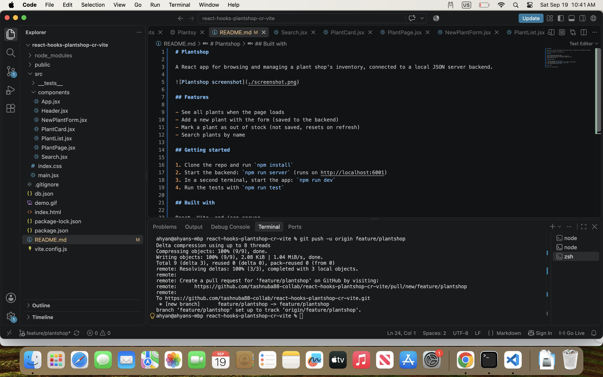

# Plantshop

A React app for browsing and managing a plant shop's inventory, connected to a local JSON server backend.

## Features

- See all plants when the page loads
- Add a new plant with the form (saved to the backend)
- Mark a plant as out of stock (not saved, resets on refresh)
- Search plants by name

## Getting started

1. Clone the repo and run `npm install`
2. Start the backend: `npm run server` (runs on http://localhost:6001)
3. In a second terminal, start the app: `npm run dev`
4. Run the tests with `npm run test`

## Built with

React, Vite, and json-server
